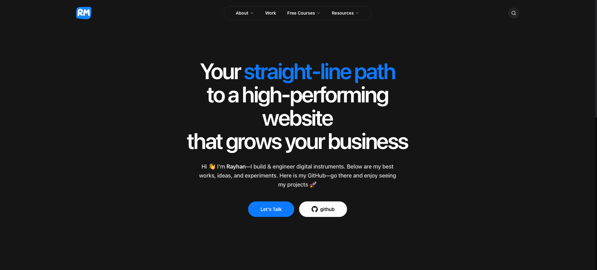

# Rayhan Mirja — Portfolio

The personal site of Rayhan Mirja — a website developer and AI automation engineer based in Dhaka, Bangladesh, working with international clients to ship fast, SEO-optimized digital systems.

Live: **[rayhanmirja.com](https://rayhanmirja.com)**



---

## Overview

This is a fully server-rendered, content-driven portfolio built on the latest Next.js App Router. It pulls featured projects directly from the GitHub API, renders long-form journal entries from local Markdown, and is wired end-to-end for SEO, Core Web Vitals, and accessibility from the first paint.

Every architectural decision in the repo is intentional — from inlined JSON-LD for crawler parsing, to font loading strategy that protects LCP, to a contact form gated behind Cloudflare Turnstile.

---

## Tech Stack

| Layer | Choice |
|---|---|
| **Framework** | Next.js 16 (App Router, RSC) |
| **Runtime** | React 19 |
| **Language** | TypeScript 5 |
| **Styling** | Tailwind CSS 4 + `@tailwindcss/typography` |
| **Animation** | Framer Motion 12 |
| **Smooth Scroll** | Lenis |
| **Theming** | `next-themes` (dark-first, system aware) |
| **Content** | Markdown + `gray-matter` + `react-markdown` + `remark-gfm` |
| **Icons** | Lucide React |
| **Analytics** | Google Analytics via `@next/third-parties` |
| **Anti-spam** | Cloudflare Turnstile |
| **Deployment** | Vercel-ready |

---

## Features

- **Server-side GitHub integration** — projects tagged `featured` on GitHub are auto-pulled, parsed, and rendered. Add a new repo with the `featured` topic and it appears on the site within 10 minutes (ISR revalidation).
- **Local Markdown journal** — write a `.md` file in `/content/posts`, get a fully styled, SEO-tagged article page with frontmatter-driven metadata.
- **SEO-first architecture** — per-route canonical URLs via `metadataBase`, full Open Graph + Twitter Card support, JSON-LD `Person` and `WebSite` schemas inlined in HTML for instant crawler parsing.
- **Dynamic sitemap & robots.txt** — generated from filesystem content at build time.
- **PWA-ready** — web manifest, themed address bar, full icon set including Apple touch icons.
- **Performance budget** — `display: swap` font loading, conditional script injection, no client JS where server components suffice.
- **Dark mode by default** — system-aware via `next-themes`, no flash of unstyled content.
- **Smooth scroll** — Lenis-powered, hardware-accelerated scroll.
- **Hardened external links** — homepage URLs from GitHub are validated against `^https?://` to prevent `javascript:` and `data:` URI XSS sinks.

---

## Project Structure

portfolio/
├── content/
│   └── posts/              # Markdown journal entries (frontmatter-driven)
├── public/                 # Static assets, OG images, icons, manifests
├── src/
│   ├── app/                # Next.js App Router
│   │   ├── about/          # About page
│   │   ├── author/         # Author page
│   │   ├── biography/      # Biography
│   │   ├── contact/        # Contact form (Turnstile-gated)
│   │   ├── journal/        # Journal listing
│   │   ├── post/[slug]/    # Dynamic post route
│   │   ├── projects/       # Projects listing
│   │   ├── layout.tsx      # Root layout, metadata, JSON-LD
│   │   ├── manifest.ts     # PWA manifest
│   │   ├── robots.ts       # Dynamic robots.txt
│   │   └── sitemap.ts      # Dynamic sitemap.xml
│   ├── components/
│   │   ├── layout/         # Navbar, Hero, Footer, ProjectsList, EntriesList, SmoothScroll, CustomCursor
│   │   ├── ui/             # ScrollProgressBar, ThemeToggle
│   │   └── ThemeProvider.tsx
│   └── lib/
│       ├── github.ts       # GitHub API integration with ISR
│       ├── posts.ts        # Markdown loader + frontmatter parser
│       └── utils.ts        # Shared helpers (clsx + tailwind-merge)
└── next.config.ts


---

## Getting Started

### Prerequisites

- Node.js 20+
- npm (or pnpm / yarn / bun)

### Installation

```bash
git clone https://github.com/rayhanmirja/portfolio.git
cd portfolio
npm install
Environment Variables
Create a .env.local file in the project root:


# Optional — used to authenticate GitHub API and avoid 60 req/hr anonymous limit
GITHUB_TOKEN=your_github_personal_access_token

# Optional — Google Analytics measurement ID
MEASUREMENT_ID=G-XXXXXXXXXX

# Optional — Cloudflare Turnstile site key for contact form
NEXT_PUBLIC_TURNSTILE_SITE_KEY=your_turnstile_site_key
TURNSTILE_SECRET_KEY=your_turnstile_secret_key
All env vars are optional — the site degrades gracefully without them.

Development

npm run dev
Open http://localhost:3000.

Production Build

npm run build
npm run start
Lint

npm run lint
Adding Content
Featured Projects
On any GitHub repo you own, add the topic featured.
Optionally add a second topic (e.g. web-app, ai-tool) — it will be used as the project category.
Add a thumbnail.png to the repo root.
Set the homepage field on the repo to your live URL.
The site picks it up automatically within 10 minutes.
Journal Posts
Create a Markdown file in content/posts/:


---
title: "Your Post Title"
date: "2026-01-15"
category: "Engineering"
isFeatured: true
thumbnail: "/post-thumbnail.jpg"
readTime: "5 min read"
---

Your content here. GitHub-flavored Markdown is fully supported.
Deployment
This project is optimized for Vercel but runs on any Node.js host that supports Next.js 16.


vercel deploy
Make sure environment variables are configured in your hosting provider's dashboard.

Performance & SEO Notes
LCP-safe fonts — Geist and Geist Mono loaded via next/font with display: swap. Mono is not preloaded since it appears below the fold.
Inlined structured data — Person and WebSite JSON-LD are written directly into <head>, not loaded as scripts. Crawlers parse them without executing JS.
Per-route canonicals — every page declares its own alternates.canonical, resolved against metadataBase.
ISR for external data — GitHub API responses are cached for 10 minutes to stay well under rate limits while keeping content fresh.
No hydration flash — suppressHydrationWarning + disableTransitionOnChange for clean theme switching.
Contact
Website — rayhanmirja.com
GitHub — @rayhanmirja
LinkedIn — rayhanmirja
X / Twitter — @Rayhan_Mirja06
License
© Rayhan Mirja. All rights reserved.

The code in this repository is shared for reference and inspiration. Please do not redistribute the design, branding, or written content as your own.


---